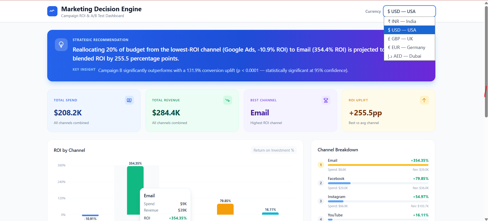

# Marketing Campaign ROI & A/B Test Dashboard

**Turn raw marketing data into budget decisions — backed by statistics, not guesswork.**


---

## Live Demo

**[frontend-lyart-psi-96.vercel.app](https://frontend-lyart-psi-96.vercel.app)** &nbsp;·&nbsp; [GitHub Repository](https://github.com/sumeet7878/marketing-decision-engine)



---

## Problem Statement

Marketing teams routinely split budgets evenly across channels with no data to justify the allocation.
Without statistical rigor, "Campaign B performed better" is anecdote — not evidence.

---

## Business Impact

> **Reallocating budget to Email — the top-performing channel at 354% ROI — from Google Ads (−10.9% ROI) is projected to improve blended ROI by 255.5 percentage points, backed by statistical A/B testing — not guesswork.**

| Metric                   | Value                   |
| ------------------------ | ----------------------- |
| Total Spend              | ₹1.74 Cr                |
| Total Revenue            | ₹2.37 Cr                |
| Best Channel             | **Email — 354% ROI**    |
| Worst Channel            | Google Ads — −10.9% ROI |
| ROI Uplift (best vs avg) | **+255.5 pp**           |

---

## Key Insight

> Campaign B (new creative) converted at **14.91% vs 6.43%** — a **131.9% uplift** with p < 0.0001. Statistically significant at 95% confidence, not random chance.

---

## A/B Test Results

Two-proportion z-test on campaign response flags (n = 2,240 customers):

| Variant               | Conversion Rate | Winner    |
| --------------------- | --------------- | --------- |
| Campaign A — Existing | 6.43%           | —         |
| Campaign B — New      | **14.91%**      | **★ Yes** |

- **Uplift:** +131.9%
- **p-value:** < 0.0001
- **95% CI on difference:** [+0.067, +0.103]
- **Verdict:** Significant at 95% confidence — roll out Campaign B to 100% of traffic.

---

## Tech Stack

| Layer         | Technology                                     |
| ------------- | ---------------------------------------------- |
| Data pipeline | Python · pandas · SciPy (z-test) · requests    |
| Frontend      | React 18 · Vite 5 · Tailwind CSS v3 · Recharts |
| Deployment    | Vercel (static)                                |

---

## How It Works

1. **Channel ROI Analysis** — Python script aggregates purchases per channel, computes spend vs revenue, ranks by ROI.
2. **Statistical A/B Test** — Two-proportion z-test compares Campaign A vs B conversion rates; outputs p-value, 95% CI, and significance verdict.
3. **Budget Recommendation** — Identifies worst and best ROI channels; quantifies projected uplift from reallocation.
4. **Static Dashboard** — Results bundled into `results.json` at build time; React dashboard renders charts, A/B card, and recommendation banner with zero backend.

---

## Features

- **ROI Bar Chart** — Per-channel comparison with color-coded bars and tooltips
- **A/B Significance Card** — Variant conversion rates, p-value, 95% CI, plain-English significance verdict
- **Recommendation Banner** — Data-driven budget reallocation call-to-action
- **Multi-Currency Toggle** — Live conversion: INR ₹ · USD $ · GBP £ · EUR € · AED د.إ
- **Mobile-Responsive** — Fluid layout, no horizontal scroll, charts resize to viewport

---

## Architecture

```
generate_analysis.py  →  results.json  →  Vite build  →  Static HTML/JS  →  Vercel CDN
```

Analysis is **pre-computed once and served statically** — instant load, zero cold-start, zero hosting cost.
The component contract is a plain JSON import; swapping it for a `fetch()` call adds a live FastAPI backend whenever real-time data is needed. Deliberate design choice: ship fast, scale later.

---

## Setup

```bash
# 1. Install Python dependencies
pip install -r requirements.txt

# 2. Generate analysis (downloads dataset automatically, falls back to synthetic if offline)
python generate_analysis.py

# 3. Start the dev server
cd frontend
npm install
npm run dev
```

Dev server binds to `0.0.0.0` and reads `PORT` from the environment — Codespaces port-forwarding works out of the box.

**Deploy to Vercel:** import the repo at [vercel.com/new](https://vercel.com/new), set Root Directory to `frontend`, done.

---

## Methodology

Statistical significance is determined using a **two-proportion z-test** — the standard choice when comparing binary conversion rates between two independent groups of equal size. The test outputs a z-statistic and two-sided p-value; significance threshold is α = 0.05 with a 95% confidence interval on the conversion rate difference.
